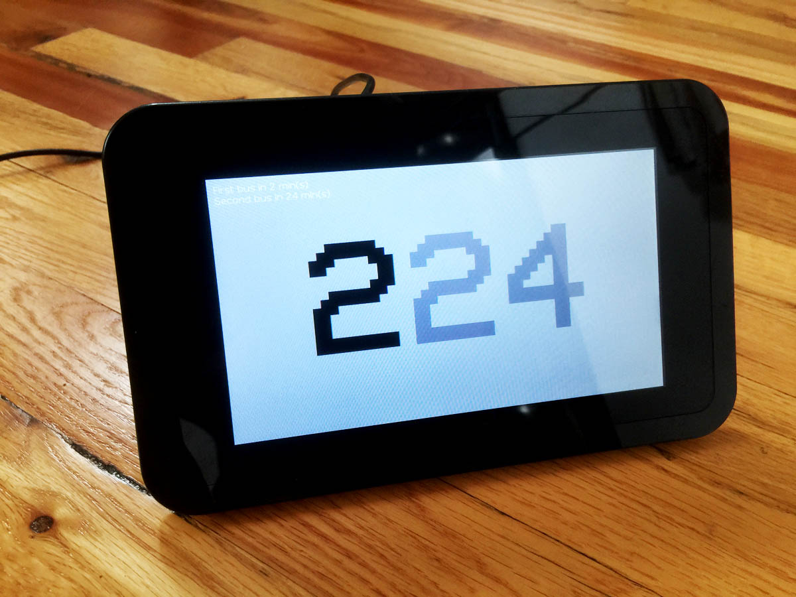

###PiCTA

This project uses the Chicago Transit Authority API to track the next two bus arrivals outside my house. I made it because I'm always checking and rechecking this information on my phone. PiCTA only displays the predicitions I care about and updates them automatically without any interaction on my part. 

Most of these components were sponsored by [Newark / Element14](http://www.newark.com/) - thanks guys!

###BOM

Part | Cost
| :--- | ---: |
| [RPi 7" touchscreen](http://www.newark.com/raspberry-pi/raspberrypi-display/display-7-touch-screen-rpi-sbc/dp/49Y1712?MER=bn_level5_3NP_EngagementRec_1) | $75 |
| [RPi 7" touchscreen enclosure](https://www.adafruit.com/products/2033) | $15 |
| [Raspberry Pi board](http://www.newark.com/raspberry-pi/rpi2-modb-8gb-noobs/sbc-raspberry-pi-2-model-b-8gb/dp/38Y6469?selectedCategoryId=&exaMfpn=true&categoryId=&searchRef=SearchLookAhead&iscrfnonsku=false) (tested on B2 v1.1) | $40 |
| [USB wifi dongle](http://www.newark.com/adafruit-industries/814/miniature-wifi-module-raspberry/dp/53W6285?ost=53W6285&selectedCategoryId=&categoryNameResp=All%2BCategories&iscrfnonsku=false) | $12 |
| [Mini USB power supply](https://www.adafruit.com/product/1995) | $8 |
| Total | $150 |

###Basic Setup

1. Assemble [touchscreen/case](https://cdn-shop.adafruit.com/product-files/2718/2718build.jpg)
2. Install [NOOBS/Jessie](http://computers.tutsplus.com/tutorials/how-to-install-noobs-on-a-raspberry-pi-with-a-mac--mac-57831) (Wheezy didn't work)
3. ```    sudo nano /boot/config.txt```
4. Add ```lcd_rotate=2``` at the end
5. reboot
6. ```sudo raspi-config```
 * Set time (important for CTA tracking)
 * Enable SSH
 * Disable overscan
7. reboot
8. Connect to wifi (icon at top right)
9. Determine Pi IP address
10. SSH to Pi
11. ```sudo apt-get update```
12. ```sudo apt-get upgrade```

###Server/Kiosk Setup

1. ```sudo apt-get install iceweasel```
2. ```sudo apt-get install apache2 -y```
10. ```sudo apt-get install php5 libapache2-mod-php5 -y```
11. ```cd /var/www```
12. ```sudo chown pi: html```
13. Replace the contents of /var/www on your RPi with the files from this repository
15. Navigate RPi browser to RPi IP (do not open local file directly)
16. Edit getxml.php and add your API key, route, and stop ID (see php file for links)
17. Edit style.css to add a custom font
16. Follow [these instructions for Firefox](https://github.com/elalemanyo/raspberry-pi-kiosk-screen) to setup kiosk mode
17. ```sudo reboot now```

###Next Steps
1. Sometimes the page tries to load before the server fires up. Hasn't happened lately, so I can't pin down the problem.
2. Would be fun to add more features, like maybe animated weather backgrounds and automatic startup based on day of week and time of day.
